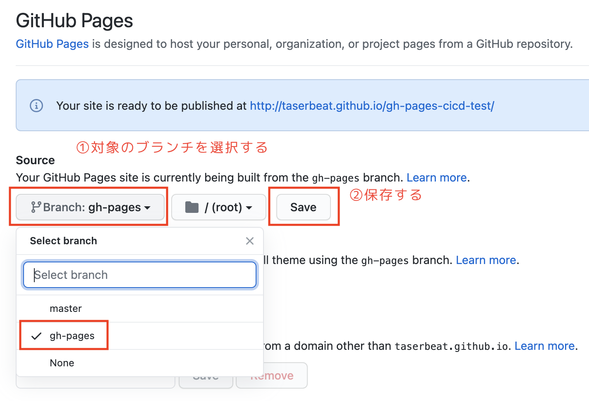
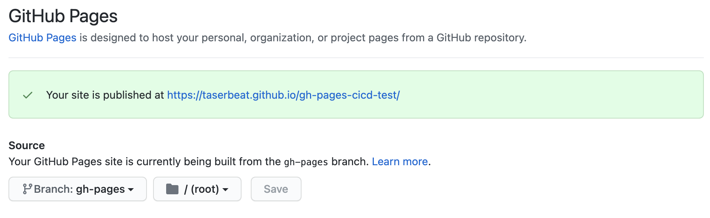

# attach-github-actions

[Github Pages](https://docs.github.com/ja/pages/getting-started-with-github-pages/about-github-pages)で CI/CD を試してみる。

# CI/CD パイプラインの構築

GitHub Actions + GitHub Pages で CI/CD パイプラインを構築する手順を記載する

## CI 環境の構築

GitHub へのプッシュやプルリクの作成イベントをトリガーに GitHub Actions で任意の Action を実行できるようにしていく。

1. `.github/workflows`フォルダにワークフローを定義する`.yml`ファイルを作成する

例:

```bash
mkdir -p .github/workflows
touch .github/workflows/ci.yml
```

2. ワークフローを定義する

[ci.yml](./.github/workflows/ci.yml)を参考。

3. GitHub の`master`ブランチにプッシュ、またはマージする

4. 定義したワークフローのイベントを発火させるイベントを起こして Action が実行されることを確認する

以上で、CI 環境が構築される。

## CD 環境の構築

GitHub Actions と GitHub Pages を連携させて、GitHub Pages へのデプロイを自動化していく。

1. デプロイ用のワークフロー定義ファイルを用意する

例

```bash
touch .github/workflows/cd.yml
```

内容は[cd.yml](./.github/workflows/cd.yml)を参考。

2. デプロイ用ワークフロー定義ファイルをプッシュする

3. GitHub Pages の初期設定を行う

- GitHub から`Settings` -> `Pages`にアクセスする

- 公開するブランチを選択する



4. しばらくするとサイトが公開される



5. 変更のコミットを追加して自動デプロイで更新されるか確認しておく

以上で、CD 環境が構築される。
